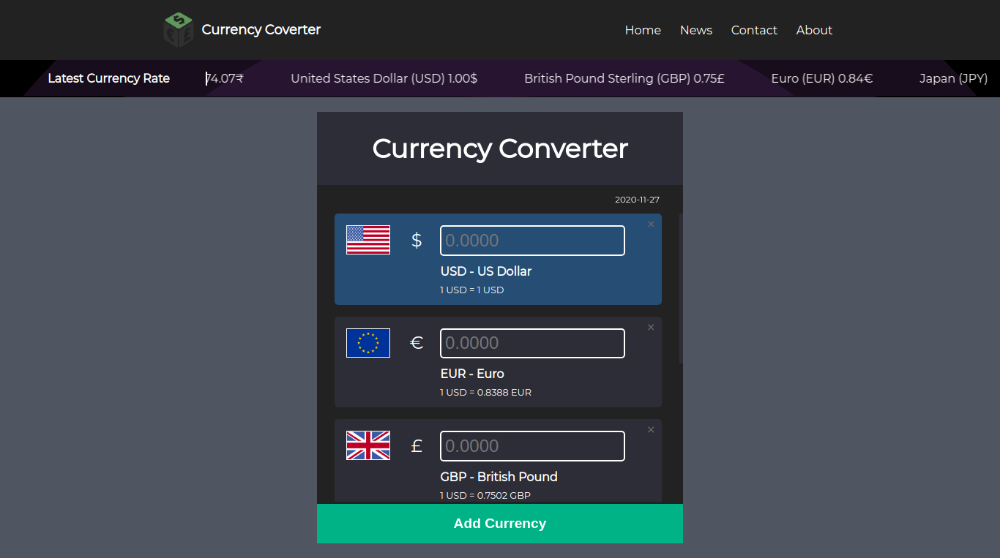

# Short News

Currency Coverter with latest news all over the world.

## Installation

First Download and Install Node js and run below command to start development environment.

```bash
git clone https://github.com/heythisisvivek/currency-converter
cd currency-converter
node i -y
npm run dev
```

Screenshots
----



Links
----
* Homepage: https://thisisvivek.ninja
* Instagram: [@heythisisvivek](https://instagram.com/heythisisvivek)
* Twitter: [@heythisisvivek](https://twitter.com/heythisisvivek)
* Telegram: [@heythisisvivek](https://t.me/heythisisvivek)

## Contributing
Pull requests are welcome. For major changes, please open an issue first to discuss what you would like to change.

Please make sure to update tests as appropriate.

## License
[MIT](https://choosealicense.com/licenses/mit/)

